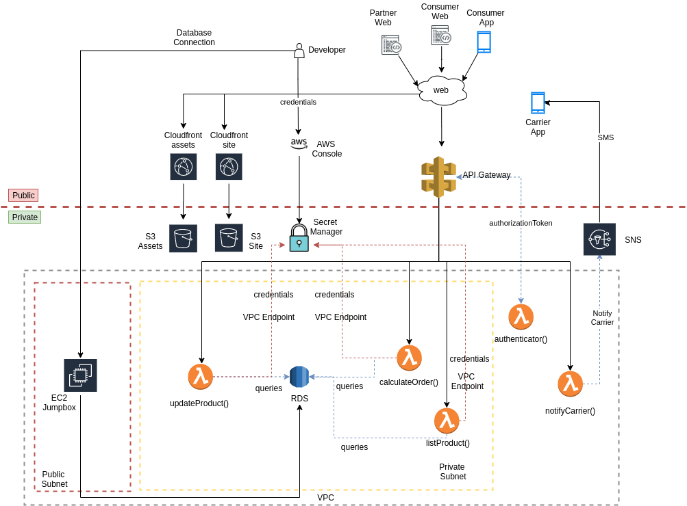

# A Servless Solution Architect
The contest purpose was to create a servless solutions architect in a delivery domain.
As a Solutions Architect I created an environment with three main principles, high availability, secure and scalable, which we can see in the follow:

## Solution Overview
As solution we designed an acrchitecture where the web users' could list the available products, select some of them, and was able to see the final bill. 
For the companies, we created an API which they could update their products data.
Finally, for the carriers we created a notification by SMS messages to be delivered in theirs mobile phones.

## Technical Solution
This solution took into account that principles. Here we can see an AWS Api Gateway as border gateway for ingress traffic. This gateway has a authorization header which is evaluated by a lambda function (_authenticator()_). For the case of an example, this lambda only ensure that there exists a header _Authorization_ with the value _allow_.

Once that the request is authenticated the target lambda function is triggered. As our intention was to provide a backend for web applications, we provided the OPTION verb for all lambdas which is necessary because of [CORS](https://developer.mozilla.org/en-US/docs/Web/HTTP/CORS). After that the browser (or user) can perform a POST request in any lambda. In the following this lambdas are explained in deep.

##### listProduct
This lambda performs a request at our database and retrieve all products. In order to do it, the lambda has a Role which enables it to perform a retrieve of the username and password of our database hosted in the Secret Manager service which one.

##### calculateOrder
As the _listProduct_ lambda, this lambda also retrieves its data from the database using those Secret Manager variables. This function exists to calculate the order price using the products and theirs amount in its payload.

##### updateProduct
As well as the order lambdas, this one also retrieve its database connection from Secret Manager. However this lambda has the intention to update a product's data.

##### notifyCarrier
Different from the other lambdas, this one do not have access to the database. Indeed this lambda connects to a Topic SNS which triggers a SMS subscription sending a SMS message for a specific carrier.

It is important to know that, excepts the notifyCarrier, all other lambdas talks to the Secret Manager by a VPC Endpoint. It is necessary because for them to connect to database, the lambdas must have a network interface (in other words, be in a VPC).

In order to provide a good user experience we hosted our web site at S3 and used Cloudfront as our [CDN](https://en.wikipedia.org/wiki/Content_delivery_network). We created two stacks for this, one for the site and other for the site's assets.

Finally for the developers access we simplified our solutions providing an EC2 jump box which has access by SSH connection using a specific key.

## Building the environment
In order to have all our solution as infra as code we used terraform. Our code are using the modules for reuse purpose.
For business lambdas we used Python 3.8, for the authenticator we used NodeJs 12 and our database is a MySql instance.

## Running
Because of the complexity of ou solution we create a [setup script](setup.sh) which creates all the stack and services. However there are some manual tasks which must be performed, in the follow we describe these actions.
- Run the [setup script](setup.sh)
- Connect to the created jumpbox EC2 and:
    - Install MySql Client using the [mysql_installation.sh](usecases/order/database/assets/mysql_installation.sh)
    - Connect to the database and run the [entrypoint.sql](usecases/order/database/assets/entrypoint.sql).
- Edit the homepage [index.html](usecases/site/content/site/index.html) adding the assets Cloudfront distribution URL in lines 4 and 5.
- Edit the homepage [index.html](usecases/site/content/site/index.html) changing the gateway variable at line 29 with the created APi Gateway URL (must have the _developer_ stage).
- Finally run the [deploy_site.sh](deploy_site.sh)
